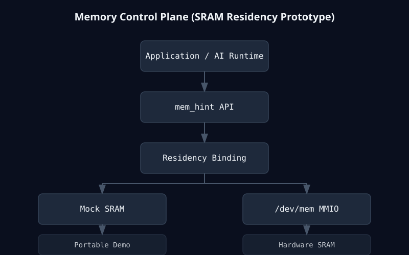
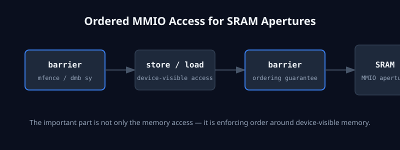

# SRAM Interface Demo: A Memory-Control-Plane Prototype

A minimal systems prototype showing how software can explicitly bind hot data to SRAM-like regions instead of relying on implicit cache behavior.

Includes:
- mock SRAM backend (portable)
- Linux /dev/mem MMIO backend
- prototype mem_hint API

🌐 **Live microsite**: [https://manishklach.github.io/sram-interface-demo/](https://manishklach.github.io/sram-interface-demo/)

---

## Architecture



This prototype exposes a thin software-visible control plane over SRAM-style memory, instead of relying purely on implicit cache behavior.

---

## Why this exists

Standard CPUs hide memory placement behind multiple layers of abstraction (caches, coherence protocols, and speculative execution). While efficient for general-purpose workloads, this model breaks down for:

- **KV-cache heavy inference**: Where deterministic residency prevents tail latency spikes.
- **Tensor tiling**: Where explicit staging overlaps computation with data movement.
- **Multi-tier memory systems**: Where placement between SRAM, HBM, and CXL must be software-directed.

This repository explores a different idea: **explicit software-directed residency in fast memory.**

---

## What this is / is not

### What this is
- A small prototype of a memory control plane.
- An educational systems demo for hardware/software co-design.
- A demonstration of explicit residency control.

### What this is not
- Not a production-ready memory driver.
- Not a kernel-level manager (though it explores the interface).
- Not a replacement for standard CPU caches or coherence.

---

## Quickstart

Build and run the demo on any environment (defaults to Mock mode):

```bash
make
./sram_demo
```

### Sample Output
```text
[mem_hint] reserve "kv_tile_0"
[mem_hint] bind → SRAM offset 0x100
[mem_hint] write → 39 bytes
[mem_hint] readback → verified ✔
```

---

## Ordered MMIO access (assembly layer)

The most important part of interacting with SRAM/MMIO isn’t the store—it’s the **ordering**.

```c
static inline void sram_barrier(void) {
#if defined(__x86_64__)
    __asm__ volatile("mfence" ::: "memory");
#elif defined(__aarch64__)
    __asm__ volatile("dmb sy" ::: "memory");
#else
    __sync_synchronize();
#endif
}
```

For MMIO/SRAM apertures, we follow an ordered pattern:
`barrier → store/load → barrier`

Without these architecture-specific instructions, CPU reordering can break correctness by allowing the hardware to observe a "ready" bit before the data payload has actually reached the aperture.


*For SRAM/MMIO apertures, correctness depends on ordering: `barrier → store/load → barrier`.*

---

## Backends

| Backend    | Platform | Purpose                 |
|-----------|----------|-------------------------|
| **Mock SRAM** | Any OS   | Development / testing   |
| **/dev/mem**  | Linux    | Hardware MMIO prototype |

---

## Use cases

- **KV-cache tile residency**: Binding active attention blocks to on-chip SRAM.
- **Tensor tile staging**: Manual orchestration of matrix multiplication tiles.
- **MoE expert placement**: Promoting active experts to fast residency.
- **FPGA scratchpad memory**: Software management of non-coherent BRAM.

---

## Roadmap

- [x] Mock backend implementation
- [x] MMIO/devmem backend implementation
- [x] Assembly-backed ordering layer
- [ ] UIO/VFIO secure mapping backend
- [ ] `/dev/mem_hint` conceptual kernel interface
- [ ] Compiler/runtime intent integration

---

## License
[MIT](LICENSE)
